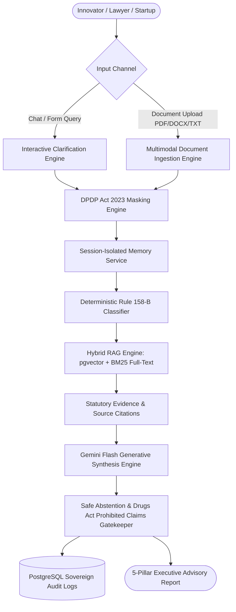

# IP-SHAKTI Sahayak — Product Requirements Document (PRD)

**Problem Statement ID**: 26045  
**Domain**: AYUSH Traditional Knowledge, Intellectual Property Rights (IPR) & Regulatory Compliance  
**Status**: Production / Hackathon Ready  
**Version**: 2.0 (PostgreSQL + pgvector, LangChain4j, Gemini Flash, DPDP Act 2023 Compliant)

---

## 1. Executive Summary & Vision

Ayurveda and Indian traditional medicine rest on millennia of codified (*Charaka, Sushruta, Sharangadhara Samhitas*) and community-held knowledge. When AYUSH startups, researchers, and MSMEs attempt to commercialize Ayurvedic products, they face a fragmented, highly punitive regulatory maze:
1. **The Patents Act, 1970**: Absolute bar on patenting traditional knowledge under **Section 3(p)**, mere admixtures under **Section 3(e)**, and known substance derivatives without enhanced efficacy under **Section 3(d)**.
2. **The Biological Diversity Act, 2002**: Mandatory prior approval from the **National Biodiversity Authority (NBA)** under Section 3/6 for foreign applicants, or prior intimation to **State Biodiversity Boards (SBB)** under Section 7 for Indian commercial entities.
3. **The Drugs and Cosmetics Act, 1940 & Rules 1945**: Rigid bifurcations between Classical Formulations (First Schedule, Rule 158-B exempt), Proprietary Medicines (Rule 158-B Category A/B with toxicity/pilot trial obligations), Phytopharmaceuticals (Rule 122-E Schedule Y), and Cosmetics (§3(aaa)).
4. **FSSAI Regulations, 2022**: Ayurveda Aahar classification, labeling rules, and strict prohibitions against therapeutic disease cure claims.
5. **DPDP Act, 2023**: Mandatory redaction of personally identifiable information (Aadhaar, PAN, phone, email) before legal analysis and sovereign audit logging.

**IP-SHAKTI Sahayak** is an authoritative, multilingual, source-grounded RAG AI Assistant designed to empower AYUSH innovators with instant, citation-backed statutory verdicts, defensive patent drafting, and regulatory roadmaps.

---

## 2. User Personas & Use Cases

| Persona | Key Pain Points | IP-SHAKTI Solution |
| :--- | :--- | :--- |
| **Ayurvedic Vaidya / Researcher** | Developing a novel herbal extract formulation but uncertain if Section 3(p) TKDL bar will trigger immediate rejection. | Clarifies classical vs proprietary boundaries; assesses novelty of delivery matrix (liposome, nano-emulsion); provides draft claims circumventing Section 3(p). |
| **AYUSH Startup / MSME** | Confused whether formulation falls under State AYUSH licensing, FSSAI Ayurveda Aahar, or CDSCO Phytopharmaceutical. | Deterministic Rule 158-B classifier routes formulation to correct authority; outlines exact clinical trial and toxicity data requirements. |
| **Patent Attorney / IP Counsel** | Needs statutory citations (acts, rules, case precedents) and prior art mapping across TKDL, INPASS, and WIPO treaties. | Hybrid vector + keyword search over 1,500+ statutory chunks with reciprocal rank fusion and exact section citations. |
| **Rural Innovator / Cultivator** | Faces language barriers; requires guidance in Hindi or Marathi. | Multilingual engine supporting Hindi, Marathi, and English via verified legal glossaries. |

---

## 3. Core Architectural Modules

### Module 1: Deterministic Regulatory & Rule 158-B Classifier
- Enforces an unbendable legal decision tree adhering to Drugs and Cosmetics Rules Rule 158-B and FSSAI Regulations 2022.
- Categories supported:
  - `CLASSICAL_AYURVEDIC_FORMULATION`: Exempt from clinical trials; strictly non-patentable under §3(p)/§3(e); trademark protection on brand prefix only.
  - `PROPRIETARY_AYURVEDIC_MEDICINE` (Rule 158-B Cat A & B): Safety/toxicity or pilot clinical trial obligations.
  - `PHYTOPHARMACEUTICAL`: CDSCO Rule 122-E Schedule Y clinical trials required.
  - `AYURVEDA_AAHAR`: FSSAI Form B license; disease cure claims prohibited.
  - `AYURVEDIC_COSMETIC`: D&C Act §3(aaa) Form 32-A; BIS IS 4707 compliance.

### Module 2: Hybrid Legal RAG Engine (PostgreSQL + pgvector)
- Dense embeddings generated via `text-embedding-004` (768 dimensions) stored in Neon PostgreSQL `statutory_chunks`.
- Sparse keyword search using PostgreSQL `tsvector` + GIN index over legal terminology.
- Windowed context expansion (preceding and succeeding statutory sections retrieved to maintain legal coherence).
- Grounding corpus comprises 1,514 indexed chunks from:
  - Indian Patents Act, 1970 (Amendments through 2024 Patent Rules)
  - Drugs and Cosmetics Act, 1940 & Rules 1945 (Rule 158-B, Schedule T, Schedule Y)
  - Biological Diversity Act, 2002 & Biological Diversity Rules, 2024
  - FSSAI (Ayurveda Aahar) Regulations, 2022
  - WIPO GRATK Treaty, 2024 (Genetic Resources and Associated Traditional Knowledge)
  - TKDL Access Framework & Landmark IPO / IPAB Case Precedents

### Module 3: Generative LLM & Legal Synthesis Engine
- Powered by Google Gemini Flash (`gemini-flash-lite-latest` / `gemini-1.5-flash`) via LangChain4j and direct REST endpoints.
- Structured JSON output format generating:
  1. **Executive Legal Brief**: Patentability score (0-100), primary statutory hurdles, and defensive prosecution strategy.
  2. **Draft Patent Claims**: Claim 1 (Product) and Claim 2 (Process) structured to circumvent Section 3(p) and Section 3(e).
  3. **Plain-Language Action Roadmap**: Step-by-step guidance translated into English, Devanagari Hindi, or Devanagari Marathi.

### Module 4: Multi-Format Document Ingestion & Statutory Analysis
- Ingests patent specifications, lab protocols, and dossiers across PDF, Word (`.docx`), and text.
- Supports native multimodal PDF parsing directly into Google Gemini Flash.
- Extracted parameters include applicant identity (Aadhaar, PAN, phone), active botanicals, novelty type, Section 3(p) risk assessment, synergism evidence, and regulatory pathway.

### Module 5: Sovereign DPDP Compliance & Safe Abstention Engine
- Real-time regex and token-based masking for Indian Aadhaar (`[REDACTED_AADHAAR]`), PAN (`[REDACTED_PAN]`), phone numbers, and emails.
- Interception of illegal therapeutic cure claims under the **Drugs and Magic Remedies (Objectionable Advertisements) Act, 1954** (e.g., claiming to cure cancer, diabetes, epilepsy, or blindness).
- Automated safe abstention if confidence score drops below 60% with escalation to human patent attorney.
- Persistent audit logging into `audit_logs` table.

### Module 6: Session-Isolated Chat Memory
- Maintains conversational history keyed strictly by `sessionId`.
- Backed by PostgreSQL `chat_messages` table with an in-memory sliding window cache.
- Prevents cross-session context pollution while allowing interactive, multi-turn clarification dialogue.

---

## 4. Non-Functional & Security Requirements

| Metric | Specification | Verification Method |
| :--- | :--- | :--- |
| **Response Latency** | ≤ 2.5 seconds for RAG retrieval + LLM synthesis | Hybrid search benchmark script (`verify_hybrid_search.py`) |
| **Data Sovereignty** | Zero persistent PII in LLM logs or audit database; all PII redacted under DPDP Act 2023 | Verified via `verify_module5_dpdp_audit.py` |
| **Offline / Resilient Mode** | Deterministic fallback generators trigger automatically if external LLM API is unavailable | Verified via unit tests with mock/empty API key |
| **Zero Cost Default** | Neon cloud PostgreSQL free tier + Google AI Studio free tier; 100% open-source stack | Production tested with zero billable cloud infrastructure |
| **Source Precision** | 100% citations tied to actual statutes, rules, or treaties (zero hallucinated sections) | Benchmark verification across test patent cases |

---

## 5. Technology Stack Summary

- **Backend**: Spring Boot 3.3.4 (Java 21 OpenJDK), Maven 3.9.15
- **Database**: PostgreSQL 16 with `pgvector` extension (Neon Cloud / Local Docker)
- **AI & LLM Framework**: LangChain4j 0.35.0, Google AI Studio Gemini Flash, Jackson JSON
- **Document Processing**: Apache PDFBox 2.0.30, Apache POI 5.2.5 (OOXML)
- **Frontend**: React + Vite, Tailwind CSS, Axios, Lucide Icons
- **Documentation**: OpenAPI 3.0 / Swagger UI, Markdown Specifications
