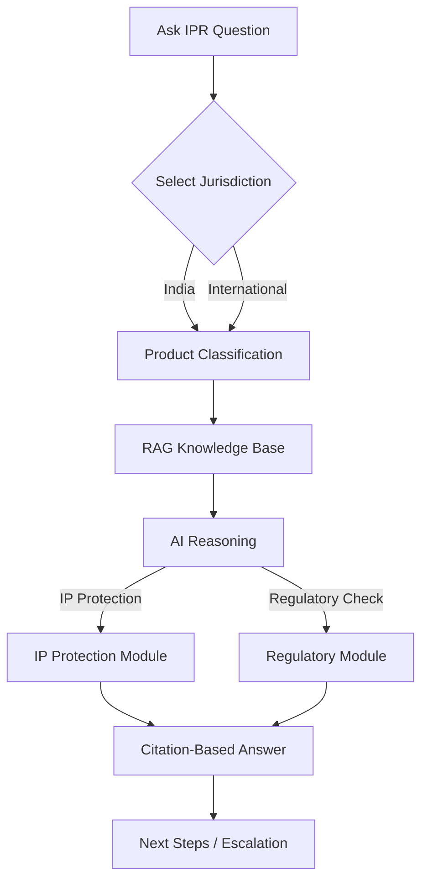

# IP‑SHAKTI Sahayak

## Problem Statement (ID 26045)

Ayurveda rests on a vast corpus of codified and community‑held traditional knowledge (TK) and on therapeutics derived from plant, microbial and animal sources. Protecting and commercialising an Ayurvedic product means navigating several overlapping regimes at once:
- Patents, Geographical Indications (GI), Trademarks, Copyright, Designs, Trade Secrets, Plant‑Variety Rights
- Access‑and‑Benefit‑Sharing (ABS) duties stemming from India’s sovereignty over its biological resources
- Drug‑regulatory frameworks that decide whether a formulation is a classical medicine, a proprietary medicine, a new drug, a phytopharmaceutical, a food or a cosmetic.

Practitioners, researchers, AYUSH startups, MSMEs and cultivators routinely struggle with this complexity. The result is two‑fold:
1. Legitimate Ayurvedic innovation is under‑protected and under‑commercialised.
2. India’s traditional knowledge remains exposed to misappropriation abroad.

Recent regulatory shifts (2024 Patent & Biodiversity Rules, WIPO GRATK Treaty 2024, evolving advertising and labelling laws) increase the need for authoritative, plain‑language guidance – a tool that currently does not exist for the AYUSH community.

---

## Solution Overview

**IP‑SHAKTI Sahayak** is a multilingual, Retrieval‑Augmented Generation (RAG) AI assistant that provides IP‑related and regulatory guidance for Ayurvedic products, with explicit jurisdiction separation (India vs International). Every answer is:
- **Source‑cited** (statute, rule, treaty article, case law, or registry record)
- **Jurisdiction‑clear** (never conflates national and international regimes)
- **Confidence‑rated** (high/medium/low) with safe‑abstention when uncertain
- **Multilingual** (Hindi, Marathi, English via Bhashini or Gemini multilingual models)
- **Disclaimer‑driven** (information only, not legal advice)

The system works in phases:
1. **Jurisdiction toggle** – user selects India or International
2. **Product classification questionnaire** – determines whether the formulation is classical Ayurvedic medicine, proprietary, new drug, phytopharmaceutical, Ayurveda‑Aahar/nutraceutical, or cosmetic
3. **RAG retrieval layer** – curated, version‑tracked corpus of statutes, rules, treaties, TKDL / prior‑art, ABS guidelines, case law
4. **AI reasoning** – routes the query through IP‑protection and regulatory‑check modules
5. **Citation‑based answer** – presents actionable next steps and escalation paths

---

## Core Modules

### 1️⃣ IP Protection 🛡️
Identifies the most suitable IP route for the user’s Ayurvedic product.
| Product Situation | Suggested IP | Simple Explanation |
|-------------------|--------------|--------------------|
| New formulation/invention | **Patent** | Grants exclusive rights if novelty & inventive step are met. |
| Brand name or logo | **Trademark** | Protects the commercial identity. |
| Traditional regional product | **Geographical Indication (GI)** | Recognises the product’s origin‑linked reputation. |
| Packaging or design | **Design protection** | Safeguards visual appearance. |
| Traditional knowledge | **TKDL / Prior‑art** | Defends against misappropriation under §3(p) of the Patents Act. |

### 2️⃣ Regulatory Check 📋
Maps the product classification to the relevant Indian and International regulatory regimes.
| Classification | Key Indian Authority | Core Requirements |
|----------------|----------------------|-------------------|
| Classical Ayurvedic medicine | **AYUSH** | Manufacturing licence, standard formulation, no clinical trial. |
| Proprietary / Patent‑eligible medicine | **CDSCO** | Safety & efficacy data, clinical study report. |
| New drug | **CDSCO** | Full clinical evidence, GMP compliance. |
| Phytopharmaceutical | **CDSCO + FSSAI** | Drug‑like evidence plus food‑safety standards. |
| Ayurveda‑Aahar / Nutraceutical | **FSSAI** | Food safety, labelling, nutrition claims. |
| Cosmetic | **Cosmetic Rules** | Safety dossier, labelling, ingredient restrictions. |

### 3️⃣ Next Steps / Escalation 🚀
After analysis, the assistant presents concrete actions:
- Verify if the formulation already exists in TKDL / prior‑art databases.
- Run a patent‑eligibility check.
- Confirm ABS obligations (Nagoya Protocol, Biodiversity Act).
- File trademark or GI application.
- Initiate regulatory approvals (AYUSH licence, CDSCO trial, FSSAI registration).
- If the query is too complex or confidence is low, the system **escalates** to a human IP/legal expert (audit log created, user notified).

---

## End‑to‑End Flow


## Technical Highlights (100% Free & Open-Source Default)
- **Frontend**: React + Vite, Tailwind CSS, i18next for multilingual UI *(MIT License)*.
- **Backend**: Spring Boot (Java 21 OpenJDK), Spring AI, WebFlux, Spring Security *(Apache 2.0)*.
- **Unified Database & Vector Store**: **PostgreSQL + `pgvector`** *(Primary Default — 100% Open Source, $0 cost, zero cloud vendor lock-in)*. Handles relational metadata, conversations, and dense legal embeddings in a single engine.
- **AI & RAG Engine**:
  - *Primary Free Cloud*: Google AI Studio Gemini API *(15 RPM Free Tier)*.
  - *Offline / Self-Hosted FOSS*: Local **Ollama** (Llama 3.1 / Gemma 2) + Open-Source Embeddings (`bge-small-en-v1.5`) via Spring AI / LangChain4j.
  - *Hybrid Search*: Vector similarity search combined with PostgreSQL BM25 full-text keyword search and cross-encoder reranking.
- **Deployment**: **Docker & Docker Compose** for reproducible, 1-command deployment (runs completely offline for hackathon demos).
- **Security & Sovereignty**: National data privacy (DPDP Act alignment), audit logging, and strict 'Information, not legal advice' disclaimers.

---

## Getting Started (100% Free & Local Setup)
1. **Clone the repository**:
   ```bash
   git clone https://github.com/Yashmanore/IP-SHAKTI.git
   cd IP-SHAKTI
   ```
2. **Start PostgreSQL with `pgvector` via Docker Compose**:
   ```bash
   docker compose up -d postgres
   ```
3. **Inspect the Authoritative Corpus**:
   - All 27 verified Gazette & Treaty PDFs are pre-loaded in `data/raw/` — see [DATASET_SOURCES.md](file:///d:/general/GenAI/IP-SHAKTI/DATASET_SOURCES.md).
4. **Run the Spring Boot Backend**:
   ```bash
   ./gradlew bootRun
   ```
5. **Run the React Frontend**:
   ```bash
   cd frontend && npm install && npm run dev
   ```
6. Open your browser at `http://localhost:5173` to test the jurisdiction toggle, classification questionnaire, and citation RAG!

---

## Disclaimer
The assistant provides **information only** and **does not constitute legal advice**. Users should consult qualified IP/legal professionals for definitive guidance.

---

*Repository structure, detailed API specs, and contributor guidelines are documented in the `docs/` folder.*