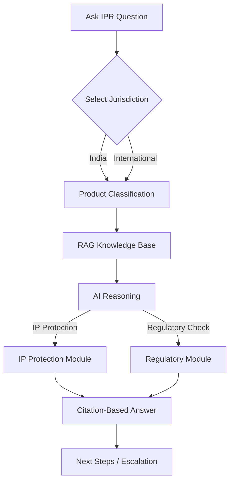

# IP‑SHAKTI Sahayak

## Problem Statement (ID 26045)

Ayurveda rests on a vast corpus of codified and community‑held traditional knowledge (TK) and on therapeutics derived from plant, microbial and animal sources. Protecting and commercialising an Ayurvedic product means navigating several overlapping regimes at once:
- Patents, Geographical Indications (GI), Trademarks, Copyright, Designs, Trade Secrets, Plant‑Variety Rights
- Access‑and‑Benefit‑Sharing (ABS) duties stemming from India’s sovereignty over its biological resources
- Drug‑regulatory frameworks that decide whether a formulation is a classical medicine, a proprietary medicine, a new drug, a phytopharmaceutical, a food or a cosmetic.

Practitioners, researchers, AYUSH startups, MSMEs and cultivators routinely struggle with this complexity. The result is two‑fold:
1. Legitimate Ayurvedic innovation is under‑protected and under‑commercialised.
2. India’s traditional knowledge remains exposed to misappropriation abroad.

Recent regulatory shifts (2024 Patent & Biodiversity Rules, WIPO GRATK Treaty 2024, evolving advertising and labelling laws) increase the need for authoritative, plain‑language guidance – a tool that currently does not exist for the AYUSH community.

---

## Solution Overview

**IP‑SHAKTI Sahayak** is a multilingual, Retrieval‑Augmented Generation (RAG) AI assistant that provides IP‑related and regulatory guidance for Ayurvedic products, with explicit jurisdiction separation (India vs International). Every answer is:
- **Source‑cited** (statute, rule, treaty article, case law, or registry record)
- **Jurisdiction‑clear** (never conflates national and international regimes)
- **Confidence‑rated** (high/medium/low) with safe‑abstention when uncertain
- **Multilingual** (Hindi, Marathi, English via Bhashini or Gemini multilingual models)
- **Disclaimer‑driven** (information only, not legal advice)

The system works in phases:
1. **Jurisdiction toggle** – user selects India or International
2. **Product classification questionnaire** – determines whether the formulation is classical Ayurvedic medicine, proprietary, new drug, phytopharmaceutical, Ayurveda‑Aahar/nutraceutical, or cosmetic
3. **RAG retrieval layer** – curated, version‑tracked corpus of statutes, rules, treaties, TKDL / prior‑art, ABS guidelines, case law
4. **AI reasoning** – routes the query through IP‑protection and regulatory‑check modules
5. **Citation‑based answer** – presents actionable next steps and escalation paths

---

## Core Modules

### 1️⃣ IP Protection 🛡️
Identifies the most suitable IP route for the user’s Ayurvedic product.
| Product Situation | Suggested IP | Simple Explanation |
|-------------------|--------------|--------------------|
| New formulation/invention | **Patent** | Grants exclusive rights if novelty & inventive step are met. |
| Brand name or logo | **Trademark** | Protects the commercial identity. |
| Traditional regional product | **Geographical Indication (GI)** | Recognises the product’s origin‑linked reputation. |
| Packaging or design | **Design protection** | Safeguards visual appearance. |
| Traditional knowledge | **TKDL / Prior‑art** | Defends against misappropriation under §3(p) of the Patents Act. |

### 2️⃣ Regulatory Check 📋
Maps the product classification to the relevant Indian and International regulatory regimes.
| Classification | Key Indian Authority | Core Requirements |
|----------------|----------------------|-------------------|
| Classical Ayurvedic medicine | **AYUSH** | Manufacturing licence, standard formulation, no clinical trial. |
| Proprietary / Patent‑eligible medicine | **CDSCO** | Safety & efficacy data, clinical study report. |
| New drug | **CDSCO** | Full clinical evidence, GMP compliance. |
| Phytopharmaceutical | **CDSCO + FSSAI** | Drug‑like evidence plus food‑safety standards. |
| Ayurveda‑Aahar / Nutraceutical | **FSSAI** | Food safety, labelling, nutrition claims. |
| Cosmetic | **Cosmetic Rules** | Safety dossier, labelling, ingredient restrictions. |

### 3️⃣ Next Steps / Escalation 🚀
After analysis, the assistant presents concrete actions:
- Verify if the formulation already exists in TKDL / prior‑art databases.
- Run a patent‑eligibility check.
- Confirm ABS obligations (Nagoya Protocol, Biodiversity Act).
- File trademark or GI application.
- Initiate regulatory approvals (AYUSH licence, CDSCO trial, FSSAI registration).
- If the query is too complex or confidence is low, the system **escalates** to a human IP/legal expert (audit log created, user notified).

---

## End‑to‑End Flow

---

## Technical Highlights
- **Frontend**: React + Vite, Tailwind CSS, i18next for multilingual UI.
- **Backend**: Spring Boot (Java 21), Spring AI, WebFlux, Spring Security.
- **RAG Stack**: Gemini/OpenAI LLM, LangChain4j or Spring AI, Pinecone/Qdrant/pgvector vector store, hybrid (semantic + keyword) search, reranker.
- **Database**: PostgreSQL for core data; optional Neo4j for knowledge‑graph extensions.
- **Deployment**: Docker Compose; cloud hosting via Render/AWS/Railway (backend) and Vercel (frontend).
- **Security & Auditing**: GDPR‑like audit logs, privacy consent for paid‑source connectors, disclaimer banner.

---

## Getting Started
1. Clone the repository.
2. Set up the PostgreSQL database and (optionally) a vector DB.
3. Populate the curated corpus (laws, rules, treaties, TKDL extracts) – see `data/README.md`.
4. Run the backend: `./gradlew bootRun`.
5. Run the frontend: `npm run dev` (inside `frontend/`).
6. Open the UI at `http://localhost:5173` and start asking IP‑related questions.

---

## Disclaimer
The assistant provides **information only** and **does not constitute legal advice**. Users should consult qualified IP/legal professionals for definitive guidance.

---

*Repository structure, detailed API specs, and contributor guidelines are documented in the `docs/` folder.*