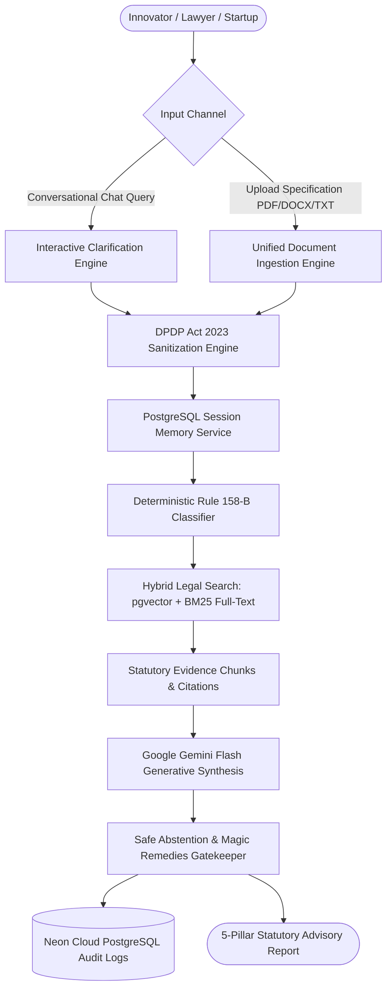

# IP-SHAKTI Sahayak 🇮🇳

### Sovereign AI Assistant for Ayurvedic IPR, Traditional Knowledge (TKDL), and Regulatory Compliance

[](https://openjdk.org/)
[](https://spring.io/projects/spring-boot)
[](https://github.com/pgvector/pgvector)
[](https://ai.google.dev/)
[](https://www.meity.gov.in/)
[](LICENSE)

> **Smart India Hackathon (SIH) Problem Statement ID**: 26045  
> **Repository**: [https://github.com/Yashmanore/IP-SHAKTI.git](https://github.com/Yashmanore/IP-SHAKTI.git)

---

## 📌 Problem Statement (ID 26045)

Ayurveda rests on a vast corpus of codified (*Charaka, Sushruta, Sharangadhara Samhitas*) and community-held traditional knowledge. Protecting and commercializing an Ayurvedic formulation requires navigating five overlapping, highly punitive statutory regimes:
1. **Patents Act 1970**: Absolute statutory bars under **Section 3(p)** (traditional knowledge), **Section 3(e)** (mere admixture), and **Section 3(d)** (derivatives without enhanced therapeutic efficacy).
2. **Biological Diversity Act 2002**: Mandatory prior approval from the **National Biodiversity Authority (NBA)** under Section 3/6 for commercial IPR, or prior intimation to **State Biodiversity Boards (SBB)** under Section 7.
3. **Drugs & Cosmetics Act 1940 & Rules 1945**: Bifurcated compliance under **Rule 158-B** between Classical formulations, Proprietary medicines, Phytopharmaceuticals (Rule 122-E), and Cosmetics (§3(aaa)).
4. **FSSAI Regulations 2022**: Ayurveda Aahar dietary supplements and mandatory labeling regulations prohibiting therapeutic cure claims.
5. **DPDP Act 2023**: Mandatory redaction of personally identifiable information before AI processing and persistent sovereign audit logging.

**IP-SHAKTI Sahayak** solves this by providing a unified, source-cited, zero-hallucination AI engine that delivers instant 5-Pillar IPR assessments, defensive patent claim drafting, and regulatory roadmaps.

---

## 🏛️ Architecture & End-to-End Workflow



---

## 🚀 Core Modules

### 1. Deterministic Regulatory Classifier (Rule 158-B)
Evaluates product formulations across an unbendable legal decision tree:
- **Classical Ayurvedic Formulation**: Exempt from clinical trials; non-patentable under §3(p)/§3(e); trademark protection on brand prefix only.
- **Proprietary Ayurvedic Medicine (Cat A & B)**: Requires published safety data, acute toxicity, or pilot clinical trials (≥30 patients).
- **Phytopharmaceutical Drug**: Governed by CDSCO / DCGI Rule 122-E Schedule Y; Phase I–III clinical trials required.
- **Ayurveda Aahar**: Governed by FSSAI 2022 Regulations; disease cure claims strictly prohibited.
- **Ayurvedic Cosmetic**: Governed by D&C Act §3(aaa) Form 32-A and BIS IS 4707 standards.

### 2. Hybrid Legal RAG Engine (pgvector + BM25 Full-Text)
- **Dense Vector Retrieval**: 768-dimensional embeddings generated via `text-embedding-004` stored in Neon PostgreSQL `statutory_chunks`.
- **Sparse Lexical Search**: Full-text `tsvector` with PostgreSQL GIN indexing for exact statutory provisions.
- **Windowed Context Expansion**: Automatically retrieves adjacent statutory sections to preserve judicial context.
- **Knowledge Corpus**: 1,514 indexed statutory chunks covering the Indian Patents Act, Biological Diversity Act, Drugs & Cosmetics Rules, FSSAI Regulations, and WIPO GRATK Treaty (2024).

### 3. Generative Legal Synthesis (Gemini Flash)
Generates structured legal deliverables via Google Gemini Flash:
- **Executive Legal Brief**: Patentability score (0-100), risk rating, and defensive prosecution strategy.
- **Draft Patent Claims**: Claim 1 (Composition) and Claim 2 (Process) crafted to overcome Section 3(p) and Section 3(e).
- **Plain-Language Action Roadmap**: Step-by-step statutory filing guidance in English, Hindi, or Marathi.

### 4. Unified Multi-Format Document Ingestion Engine
- Ingests **PDF, Microsoft Word (`.docx`), and plain text (`.txt`)** specifications or direct text queries.
- Utilizes native multimodal PDF ingestion via Google Gemini Flash pure JSON mode.
- Extracts applicant identity, botanical binomials, product category, novelty mechanisms, and Section 3(p) clearance in a single unified pipeline.

### 5. Sovereign DPDP Act 2023 Sanitization & Safe Abstention Engine
- Real-time token masking for Indian Aadhaar (`[REDACTED_AADHAAR]`), PAN (`[REDACTED_PAN]`), phone numbers, and emails.
- Guardrails against the **Drugs and Magic Remedies (Objectionable Advertisements) Act 1954** prohibiting false cure claims.
- Automated safe abstention when confidence score drops below 60%.
- Sovereign audit trails persisted in PostgreSQL `audit_logs` table.

### 6. Session-Isolated Conversational Memory
- Backed by the PostgreSQL `chat_messages` table and an in-memory sliding window cache.
- Isolates conversation state strictly by `sessionId` to support multi-turn clarifying dialogues without cross-session pollution.

### 7. Detailed PDF Legal Dossier Generation & Registered Email Dispatch
- Generates an exhaustive, multi-page **Official IPR & Regulatory Dossier PDF** containing:
  - 🏛️ Executive Summary & Patentability Scorecard (0–100 gauge with risk rating)
  - 📋 Rule 158-B Regulatory Classification Matrix (forms, clinical trial obligations)
  - 🛡️ Section 3(p) TKDL Bar & Synergism Defense (Combination Index $CI < 0.7$, lipid matrix)
  - 🌿 Biological Diversity Act Checklist (NBA Form I/III or SBB Section 7 intimation)
  - ⚖️ Synthesized Draft Patent Claims (Claim 1 Product & Claim 2 Process claims)
  - 📜 Statutory Source Citations & Phase-by-Phase Roadmap
  - 🔒 DPDP Act 2024 Masking Stamp & Sovereign Disclaimer
- Automatically delivers the attached PDF dossier to the applicant's registered email inbox via Spring Boot `JavaMailSender`.

---


## 🛠️ Technology Stack

| Layer | Technology | Description |
| :--- | :--- | :--- |
| **Backend Framework** | Spring Boot 3.3.4 (Java 21 OpenJDK) | High-performance enterprise REST API |
| **Relational & Vector Database** | Neon PostgreSQL 16 + `pgvector` | Unified relational data, chat memory, audit logs, and vector embeddings |
| **AI & LLM Orchestration** | LangChain4j 0.35.0 & Google Gemini Flash | Sovereign legal reasoning & structured JSON generation |
| **Document Processing** | Apache PDFBox 2.0.30 & Apache POI 5.2.5 | Multi-format PDF and Word DOCX extraction |
| **Build & Packaging** | Apache Maven 3.9.15 | Zero-warning deterministic build |
| **Documentation** | OpenAPI 3.0 & Swagger UI | Interactive API documentation |

---

## 📂 Project Structure

```text
IP-SHAKTI/
├── pom.xml                                      # Maven dependencies (Spring Boot, pgvector, LangChain4j, POI, PDFBox)
├── README.md                                    # Project documentation & setup guide
├── PRD.md                                       # Comprehensive Product Requirements Document
├── SPEC.md                                      # Detailed Technical Architecture Specification
├── verify_document_analysis.py                  # Root entry point for unified document analysis
├── .env                                         # Environment secrets (Database credentials, Gemini API key)
│
├── src/main/java/com/ayurveda/ipr/
│   ├── IpShaktiApplication.java                 # Spring Boot application entry point
│   ├── audit/                                   # Sovereign DPDP audit entities and repositories
│   ├── chat/                                    # Conversational orchestrator, chat memory, and models
│   ├── classifier/                              # Deterministic Rule 158-B statutory classifier
│   ├── config/                                  # Spring Security, CORS, and OpenAPI Swagger configurations
│   ├── controller/                              # REST Controllers (Chat, Classifier, Document, RAG, Audit, etc.)
│   ├── document/                                # Multi-format document parser, models, and Gemini analysis service
│   ├── dpdp/                                    # DPDP Act 2023 sanitization & Safe Abstention engine
│   ├── llm/                                     # GeminiGenerativeService with session-grounded prompt engineering
│   ├── multilingual/                            # Multilingual translation service (Hindi, Marathi, English)
│   ├── portal/                                  # External IP Office portal connectors (INPASS, TKDL, CDSCO)
│   └── rag/                                     # Hybrid search service (pgvector + GIN BM25 full-text)
│
├── sample_data_for_test/                        # Test patent specifications
│   ├── patent.pdf                               # Ayurvedic cosmetic formulation patent (Haridra & Kumkumadi)
│   ├── phytopharmaceutical_patent.pdf           # CDSCO Rule 122-E Boswellia serrata fraction patent
│   └── ayurveda_alternative_process_patent_example.pdf # Classical scripture alternative process patent
│
├── scripts/                                     # Python verification & benchmark test suites
│   ├── verify_hybrid_search.py                  # Benchmarks reciprocal rank fusion on Neon PostgreSQL
│   ├── verify_module4_gemini.py                 # Tests Gemini Flash 5-pillar advisory report generation
│   ├── verify_module5_dpdp_audit.py             # Validates DPDP PII redaction and audit logging
│   ├── verify_session_memory.py                 # Verifies PostgreSQL multi-turn session chat memory
│   └── verify_document_analysis.py              # Universal multimodal document ingestion test suite
│
└── docs/
    ├── API_DOCUMENTATION.md                     # Comprehensive REST API specifications and schemas
    └── openapi.json                             # OpenAPI v3 schema export
```

---

## ⚙️ Setup & Installation

### 1. Prerequisites
- **Java 21 LTS** (OpenJDK recommended)
- **Apache Maven 3.9+**
- **Python 3.10+** (for test scripts)
- **PostgreSQL 16 with `pgvector`** (or free [Neon.tech](https://neon.tech) cloud account)

### 2. Configure Environment Variables
Create or update `.env` in the project root:
```properties
# Neon Cloud / Local PostgreSQL
SPRING_DATASOURCE_URL=jdbc:postgresql://ep-example.neon.tech/neondb?sslmode=require
SPRING_DATASOURCE_USERNAME=your_db_username
SPRING_DATASOURCE_PASSWORD=your_db_password

# Google Gemini AI Studio API
GEMINI_API_KEY=your_gemini_api_key
GEMINI_MODEL=gemini-flash-lite-latest
```

### 3. Build & Compile Backend
```powershell
mvn clean compile -DskipTests
```

### 4. Run Spring Boot Server
```powershell
mvn spring-boot:run
```
The server starts at `http://localhost:8085`.
- **Interactive Swagger UI**: `http://localhost:8085/swagger-ui/index.html`
- **OpenAPI Schema**: `http://localhost:8085/v3/api-docs`

---

## 🧪 Verification & Benchmark Test Suites

Run any of the automated test suites from the project root:

```powershell
# 1. Verify Hybrid Search (Dense pgvector + Sparse BM25 Full-Text)
python scripts/verify_hybrid_search.py

# 2. Verify Google Gemini Flash Legal Synthesis & Citations
python scripts/verify_module4_gemini.py

# 3. Verify DPDP Act 2023 PII Redaction & Safe Abstention Engine
python scripts/verify_module5_dpdp_audit.py

# 4. Verify PostgreSQL Session-Isolated Multi-Turn Chat Memory
python scripts/verify_session_memory.py

# 5. Verify Unified Multi-Format Document Ingestion (PDF / DOCX / Text)
python verify_document_analysis.py

# 6. Verify Detailed PDF Legal Dossier Generation & Registered Email Dispatch
python scripts/verify_pdf_report_and_email.py
```


---

## 📡 REST API Highlights

| Endpoint | Method | Description |
| :--- | :--- | :--- |
| `/api/v1/chat/message` | `POST` | Multi-turn conversational consultation with interactive clarifying chips |
| `/api/v1/document/analyze` | `POST` | Multipart upload for PDF, DOCX, or TXT patent specifications |
| `/api/v1/document/analyze-text` | `POST` | Direct JSON analysis of inline formulation descriptions |
| `/api/v1/classifier/evaluate` | `POST` | Deterministic Rule 158-B and statutory classification |
| `/api/v1/rag/search` | `GET` | Hybrid legal search across 1,500+ statutory sections |
| `/api/v1/audit/recent` | `GET` | Retrieves recent sovereign audit logs with redacted personal identifiers |

Detailed request and response payloads are available in [`docs/API_DOCUMENTATION.md`](docs/API_DOCUMENTATION.md).

---

## 🛡️ Sovereign Compliance & Disclaimer

IP-SHAKTI Sahayak complies with:
- **Digital Personal Data Protection Act (DPDP Act), 2023** of the Republic of India.
- **Drugs and Magic Remedies (Objectionable Advertisements) Act, 1954**.
- **WIPO Treaty on Intellectual Property, Genetic Resources and Associated Traditional Knowledge (2024)**.

*Disclaimer: IP-SHAKTI Sahayak provides automated statutory information and preliminary regulatory triage for AYUSH researchers, startups, and practitioners. It does not replace formal legal counsel from an enrolled Indian Patent Agent or Advocate.*