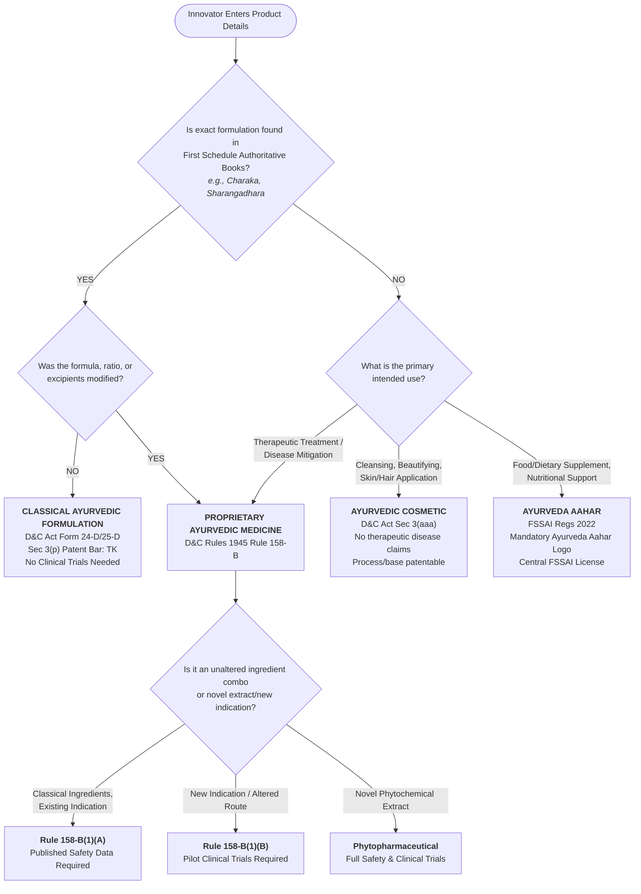

# IP‑SHAKTI Project Specification (Condensed)

## 1. Technical Architecture Overview
```
                         ┌─────────────────┐
                         │      USER       │
                         │ Web / Mobile UI │
                         └────────┬────────┘
                                  │
                                  ▼
                    ┌─────────────────────────┐
                    │   Query Understanding   │
                    │ • Language Detection    │
                    │ • Intent Detection      │
                    │ • Jurisdiction          │
                    └────────────┬────────────┘
                                 │
                                 ▼
                    ┌─────────────────────────┐
                    │ Product Classification  │
                    └────────────┬────────────┘
                                 │
                 ┌───────────────┴───────────────┐
                 ▼                               ▼
        ┌───────────────┐               ┌──────────────┐
        │ IP Protection │               │ Regulatory   │
        │   Analysis    │               │    Check     │
        └───────┬───────┘               └──────┬───────┘
                │                              │
                └───────────────┬──────────────┘
                                ▼
                       ┌─────────────────────┐
                       │   RAG Retrieval Layer│
                       │  Vector DB + Filters│
                       └────────────┬─────────┘
                                    ▼
                       ┌─────────────────────┐
                       │       LLM Engine    │
                       │ Citation + Safety   │
                       └────────────┬─────────┘
                                    ▼
                               FINAL ANSWER
```

## 2. Recommended Tech Stack

### 2.1 Primary Default Configuration (100% Free & Open-Source / FOSS)
*Designed for Smart India Hackathon (SIH), national data sovereignty, and zero recurring infrastructure cost:*
- **Frontend**: React (Vite), Tailwind CSS, React Router, Axios, i18next *(MIT License — 100% Free & Open Source)*.
- **Backend**: Spring Boot 3.x (Java 21 OpenJDK), Spring AI, Spring WebFlux, Spring Security *(Apache 2.0 / OpenJDK — 100% Free & Open Source)*.
- **Database & Vector Store (Unified)**: **PostgreSQL with `pgvector` extension** *(PostgreSQL License — 100% Free & Open Source)*.
  - Serves as the single unified engine for structured relational entities (users, chats, audit logs) and dense vector embeddings.
  - Eliminates external cloud dependencies and commercial SaaS costs.
- **Embeddings & LLM**:
  - *Primary Free Cloud*: Google AI Studio Gemini 1.5 Flash *(Generous 15 RPM Free Tier)*.
  - *100% Offline / Sovereign Alternative*: Local **Ollama** (Llama 3.1 8B / Gemma 2 9B) with open-source embeddings (`bge-small-en-v1.5` / `all-MiniLM-L6-v2`) via Spring AI / LangChain4j.
- **Deployment**: **Docker & Docker Compose** *(Self-hosted, offline hackathon-ready, zero hosting expense)*.

### 2.2 Optional / Secondary Cloud Alternatives
- **Vector DB**: Qdrant (Self-hosted/Cloud), Pinecone (Proprietary SaaS starter tier).
- **LLMs**: OpenAI API (Paid commercial).
- **Cloud Hosting**: Render, Railway, AWS, Vercel (Hobby tiers).

## 3. Core MVP Features
### 3.1 Jurisdiction Switch
- Store `jurisdiction` in each document chunk metadata.
- Filter vector‑DB queries by `jurisdiction` (`INDIA` vs `INTERNATIONAL`).

### 3.2 Product Classification Engine (Rule 158-B Decision Tree)
A deterministic rule-based decision tree that classifies Ayurvedic products prior to RAG retrieval according to the Drugs and Cosmetics Act 1940 (Rule 158-B), FSSAI Ayurveda Aahar Regulations 2022, Indian Patents Act 1970 (§3(p), §3(e), §2(1)(j)), and Biological Diversity Act 2002.



#### Deterministic Classification Logic:
1. **Classical Ayurvedic Formulation (Shastriya Aushadhi)**:
   - Found verbatim in First Schedule textbooks (e.g., *Charaka Samhita*, *Sushruta Samhita*, *Sharangadhara Samhita*).
   - Form 25-D / 24-D state AYUSH manufacturing license.
   - **Clinical Trials**: Completely exempt (presumption of traditional safety & efficacy).
   - **Patent Bar**: Strictly non-patentable under **Section 3(p)** (traditional knowledge) and **Section 3(e)** (mere admixture) of Patents Act 1970.
   - **IP Protection**: Trademark protection on house brand name only (generic classical name cannot be trademarked).
2. **Proprietary Ayurvedic Medicine (Rule 158-B)**:
   - Contains Ayurvedic ingredients, but proprietary ratio, new excipients, or new clinical indication.
   - **Category A (Rule 158-B(1)(A))**: Published textual references and acute toxicity data required.
   - **Category B (Rule 158-B(1)(B))**: New indication or altered route of administration; pilot clinical trials (≥30 patients) required.
   - **Patentability**: Product composition barred under §3(p)/§3(e) unless statistical synergism is demonstrated; novel extraction processes and delivery mechanisms (NDDS) are patentable under §2(1)(j).
3. **Phytopharmaceutical Drug (Rule 122-E)**:
   - Purified bioactive fractions / standardized botanical extract.
   - CDSCO / DCGI regulatory pathway with mandatory Phase I–III clinical trials.
   - Patentable under §2(1)(j) & §3(d).
4. **Ayurveda Aahar (FSSAI Regulations 2022)**:
   - Nutritional food/dietary supplement prepared according to Ayurvedic principles without therapeutic claims or parenteral form.
   - Central FSSAI License with mandatory "Ayurveda Aahar" logo.
   - Prohibited from claiming disease cure; exempt from clinical trials.
5. **Ayurvedic Cosmetic (D&C Act Section 3(aaa))**:
   - Cleansing, beautifying, or altering skin/hair appearance without therapeutic claims.
   - Form 32-A AYUSH cosmetic license; BIS safety compliance.

#### Example API Request & Response:

**Request: Classical Formulation Check**
```json
POST /api/v1/classifier/evaluate
{
  "productName": "Maha Sudarshan Churna",
  "matchesScheduleIBook": true,
  "scheduleIBookName": "Sharangadhara Samhita",
  "formulaOrRatioModified": false,
  "intendedUse": "THERAPEUTIC_TREATMENT",
  "applicantType": "INDIAN_COMPANY",
  "commercialUtilization": true
}
```

**Output Verdict:**
```json
{
  "category": "CLASSICAL_AYURVEDIC_FORMULATION",
  "categoryDisplayName": "Classical Ayurvedic Formulation (Shastriya Aushadhi)",
  "governingAct": "Drugs and Cosmetics Act 1940, First Schedule Books; Rule 158-B",
  "licensingAuthority": "AYUSH State Licensing Authority (Form 25-D / Form 24-D)",
  "clinicalTrialRequirement": "COMPLETELY EXEMPT from clinical trials. Enjoys legal presumption of safety and efficacy based on centuries of documented traditional usage in authoritative texts.",
  "formulationPatentableInIndia": false,
  "patentabilityVerdict": "STRICTLY NON-PATENTABLE. Section 3(p) of the Indian Patents Act 1970 explicitly prohibits patenting any traditional formulation already documented in classical scriptures (and indexed in TKDL).",
  "relevantPatentSections": [
    "Section 3(p) - Traditional Knowledge Bar (Absolute)",
    "Section 3(e) - Mere Admixture"
  ],
  "recommendedIprStrategy": "Brand Name Trademark Protection (Trade Marks Act 1999). Note: The generic classical name ('Maha Sudarshan Churna') CANNOT be trademarked, but your brand prefix can (e.g., 'Arogya Maha Sudarshan Churna').",
  "nbaComplianceStatus": "Prior Intimation to State Biodiversity Board (SBB) required under Section 7 for commercial utilization.",
  "requiredNbaForm": "SBB Form (Prior Intimation to State Biodiversity Board under Section 7)"
}
```

### 3.3 IP Protection Router
- After classification, route to appropriate IP type (Patent, Trademark, GI, Design).
- Simple Java service returns list of viable protections.

### 3.4 Regulatory Check Engine
- Mapping table (`product_type → authority → requirements`).
- Returns regulatory guidelines for the selected product.

### 3.5 RAG System (Citation‑Based)
- **Embedding → Vector Search → Keyword Search → Reranker → LLM**.
- Every answer includes structured citation blocks.
- Confidence score (high/medium/low) calculated from retrieval & authority scores.

## 4. Document Ingestion Pipeline
1. Harvest PDFs/HTML from government sites.
2. Text extraction → cleaning → hierarchical chunking (chapter/section/subsection).
3. Generate embeddings → store in vector DB with rich metadata (jurisdiction, section, etc.).

## 5. Citation & Confidence Engine
- Each chunk stores `{document, section, citation, source_url}`.
- LLM prompt enforces: *Only answer using provided context; always cite.*
- Confidence = `0.5*retrievalScore + 0.3*authorityScore + 0.2*citationCoverage`.
- Low confidence triggers safe‑abstention message.

## 6. Database Schema (PostgreSQL)
```sql
CREATE TABLE users(id SERIAL PRIMARY KEY, name TEXT, email TEXT);
CREATE TABLE conversations(id SERIAL PRIMARY KEY, user_id INT, jurisdiction TEXT);
CREATE TABLE documents(id SERIAL PRIMARY KEY, title TEXT, source TEXT, jurisdiction TEXT, version TEXT);
CREATE TABLE document_chunks(id SERIAL PRIMARY KEY, document_id INT, content TEXT, section TEXT, embedding BYTEA);
CREATE TABLE citations(id SERIAL PRIMARY KEY, document_id INT, section TEXT, source_url TEXT);
CREATE TABLE product_classifications(id SERIAL PRIMARY KEY, product_type TEXT, confidence NUMERIC);
CREATE TABLE audit_logs(id SERIAL PRIMARY KEY, user_query TEXT, retrieved_sources TEXT, generated_answer TEXT, timestamp TIMESTAMP);
```

## 7. Backend Service Flow (Package Layout)
```
com.ayurveda.ipr
│   ├─ controller
│   ├─ service
│   │   ├─ QueryService
│   │   ├─ ClassificationService
│   │   ├─ RetrievalService
│   │   ├─ IPAnalysisService
│   │   ├─ RegulatoryService
│   │   ├─ ConfidenceService
│   │   └─ CitationService
│   ├─ rag (Embedding, VectorStore, HybridSearch, Reranker)
│   ├─ agent (Orchestrator, IPAgent, RegulatoryAgent, CitationAgent)
│   ├─ repository
│   ├─ entity
│   └─ config
```

## 8. Roadmap (Phased Development)
**Phase 1 – MVP**: Jurisdiction filter + RAG + Citation + basic UI.
**Phase 2 – Classification & IP Router**: Rule‑based questionnaire, IP options.
**Phase 3 – Hybrid Search & Confidence**: Add keyword search, confidence scoring, safe abstention.
**Phase 4 – Knowledge Graph**: Neo4j for entity relationships.
**Phase 5 – Agentic AI**: Specialized agents (IP, Regulatory, ABS, Citation).
**Phase 6 – Multilingual & Voice**: Bhashini integration, Hindi/Marathi UI.

---
*Only the most critical components are listed (≈70 % of the original detail) to keep the spec concise while preserving the architectural vision.*